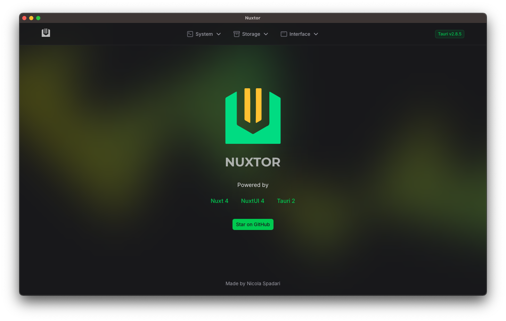

<p align="center">
    
</p>
<h1 align="center">NUXTOR</h1>
<p align="center">
A spiritual successor of <a href="https://github.com/NicolaSpadari/vitauri">ViTauri</a>, made with <a href="https://nuxt.com">Nuxt 4</a> and <a href="https://v2.tauri.app">Tauri 2</a>
<br>
Build super fast desktop applications!
</p>

<br />

<p float="left">
	
	
</p>

<br />

<div align="center">

</div>

<p align="center">Powered by Nuxt 4</p>

Check more screenshots at [preview](https://github.com/NicolaSpadari/nuxtor/blob/main/preview.md)

<br />

## Technologies run-down

- Nuxt v4
- Tauri v2
- NuxtUI v4
- TailwindCSS v4
- Typescript
- ESLint
- Auto imports (for Tauri api too!)

## Functionalities

- Run shell commands from the app
- Send custom notifications to the client (remember to turn on/grant notifications in your computer settings)
- Display OS related informations
- Store and retrieve data locally
- Show tray icon
- Support all Nuxt functionalities (routing/layout/middleware/modules/etc...)

## Setup

  - Before running this app, you need to configure your environment with Rust. Take a look at the [Tauri docs](https://tauri.app/start/prerequisites).
  - This project enforces [bun](https://bun.sh). In order to use another package manager you need to update `package.json` and `tauri.conf.json`
  - The frontend runs on the usual port `3000` of Nuxt, the Tauri server uses the port `3001`. This settings are customizable in the `nuxt.config.ts` and `tauri.conf.json`.
  - Once ready, follow these commands:

  ```sh
  # use this template
  $ npx degit NicolaSpadari/nuxtor my-nuxtor-app

  # go into the folder
  $ cd my-nuxtor-app

  # install dependencies
  $ bun install

  # start the project
  $ bun run tauri:dev
  ```

  This will run the Nuxt frontend and will launch the Tauri window.

## Build

  ```sh
  $ bun run tauri:build
  ```

This command will generate the Nuxt static output and bundle the project under `src-tauri/target`.

## Debug

  ```sh
  $ bun run tauri:build:debug
  ```

The same Tauri bundle will generate under `src-tauri/target`, but with the ability to open the console.

## Notes

- Tauri v2 brings some big refactors, such as packages names and permission management. New permissions have to be granted under `src-tauri/capabilities/main.json`
- Tauri functions are auto imported with the help of a custom module, named like `useTauri<LibraryName>`. If another Tauri plugin is added, then the module has to be updated to support its functions under `app/modules/tauri.ts`
- As per [documentation](https://tauri.app/start/frontend/nuxt/#checklist), Nuxt SSR must be disabled in order for Tauri to act as the backend. Still, all Nuxt goodies will be functional.
- NuxtUI is a very powerful UI library that consolidates design over the entire application. While version 4 is still in alpha, it includes old pro components of the v3.

## License

MIT License © 2024-PRESENT [NicolaSpadari](https://github.com/NicolaSpadari)
