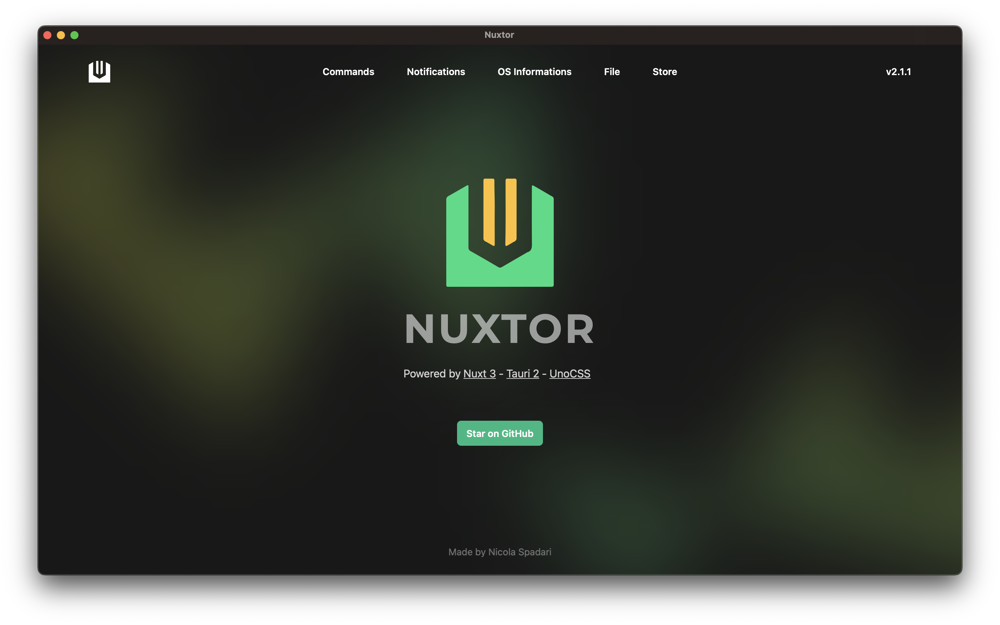

  

<h1 align="center">NUXTOR</h1>

  <a href="https://github.com/NicolaSpadari/vitauri">ViTauri</a> 的精神续作，
  基于 <a href="https://nuxt.com">Nuxt 4</a> 与
  <a href="https://v2.tauri.app">Tauri 2</a> 构建。
   
  打造极速的桌面端与移动端应用。

  
  

  <a href="README.md">English</a> | <a href="README.zh-CN.md">简体中文</a>

  

<strong>由 Nuxt 4 强力驱动</strong>

📸 实时预览：  
https://github.com/NicolaSpadari/nuxtor/blob/main/preview.md

技术栈

• Nuxt v4

• Tauri v2

• Nuxt UI v4

• Tailwind CSS v4

• TypeScript

• ESLint

• 自动导入（含 Tauri API）

功能特性

• 在应用中执行 Shell 命令

• 发送操作系统级通知

• 获取系统信息

• 持久化键值存储

• 系统托盘图标

• 完整的 Nuxt 特性支持（路由、布局、中间件、模块等）

适用人群

✅ 希望在桌面 / 移动应用中享受 Nuxt 开发体验 的开发者  
✅ 已在使用 Vue / Nuxt / Tailwind 的团队  
✅ 面向 Windows / macOS / Linux / iOS / Android 平台的项目  

❌ 不适用于需要托管式 SSR 的场景（本项目有意禁用 SSR）

环境配置

🚀 默认包管理器为 Bun。  

若需使用 npm / pnpm / yarn，请自行修改 package.json 与 tauri.conf.json。

• 前端地址：http://localhost:3000

• Tauri 后端：http://localhost:3001

• 端口可在 nuxt.config.ts 与 tauri.conf.json 中配置
# 初始化新项目
npx degit NicolaSpadari/nuxtor my-nuxtor-app

cd my-nuxtor-app

# 安装依赖
bun install

# 启动开发模式
bun run tauri:dev

⚠️ Nuxt SSR 已被禁用，以便 Tauri 充当后端服务。  

路由、中间件、组合式函数及其他所有 Nuxt 功能均可正常使用。

构建打包

bun run tauri:build

输出目录：src-tauri/target

调试版构建

bun run tauri:build:debug

启用后可在打包后的应用中访问控制台。

iOS 开发

需 macOS + Xcode 环境。
# 首次配置
brew install cocoapods
tauri ios init

# 开发模式
bun tauri:ios:dev

# 生产构建
bun tauri:build:ios

在 Xcode 中：
• 开启 Automatically manage signing（自动管理签名）

• 选择个人 Development Team（开发团队）

Android 开发

需 Android Studio + SDK + NDK 环境。
# 首次配置
tauri android init

# 开发模式
bun tauri:android:dev

# 生产构建
bun tauri:build:android

注意事项

• Tauri v2 包含破坏性变更（包名、权限等）。

• 权限需在 src-tauri/capabilities/main.json 中声明。

• Tauri API 通过 app/modules/tauri.ts 实现自动导入。

• 新增 Tauri 插件时需同步更新该模块。

开源协议

MIT © 2024–至今 https://github.com/NicolaSpadari
