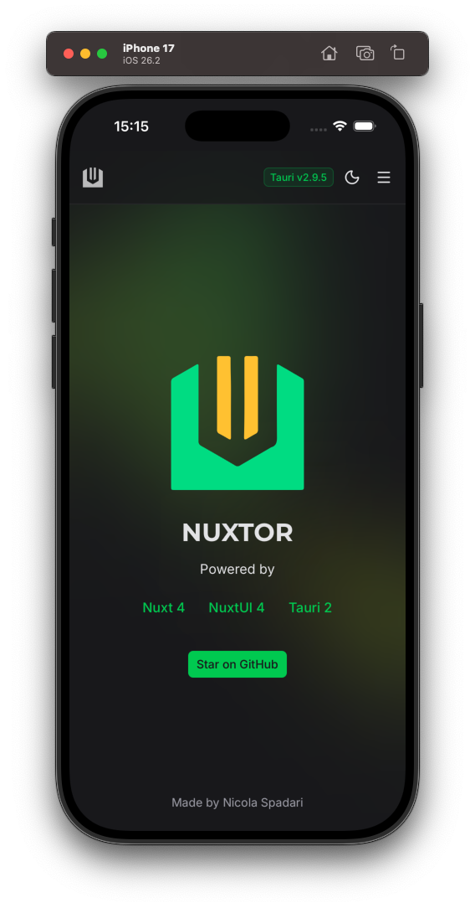
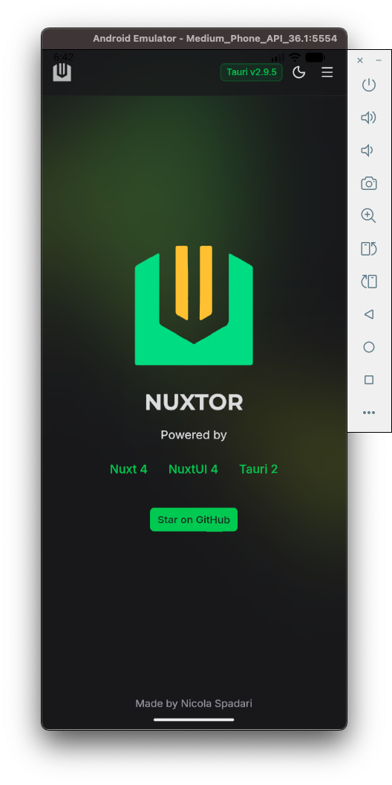
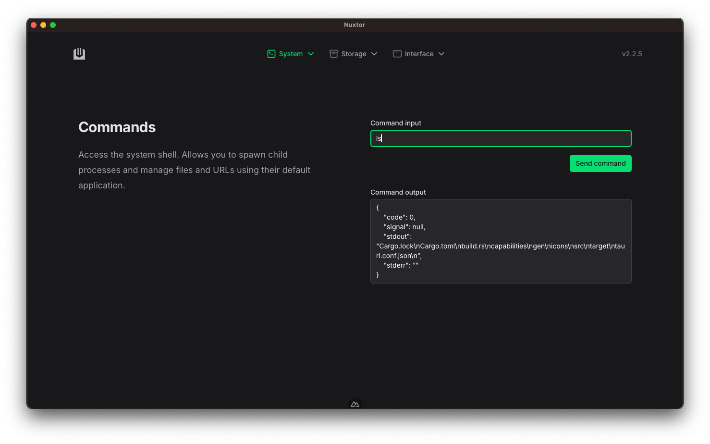
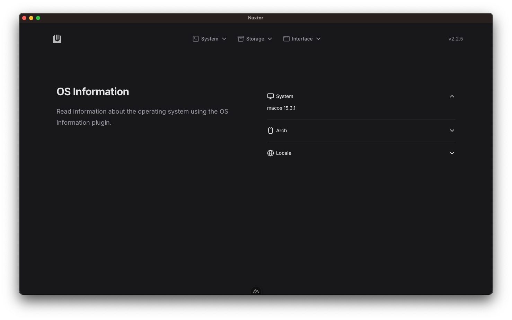
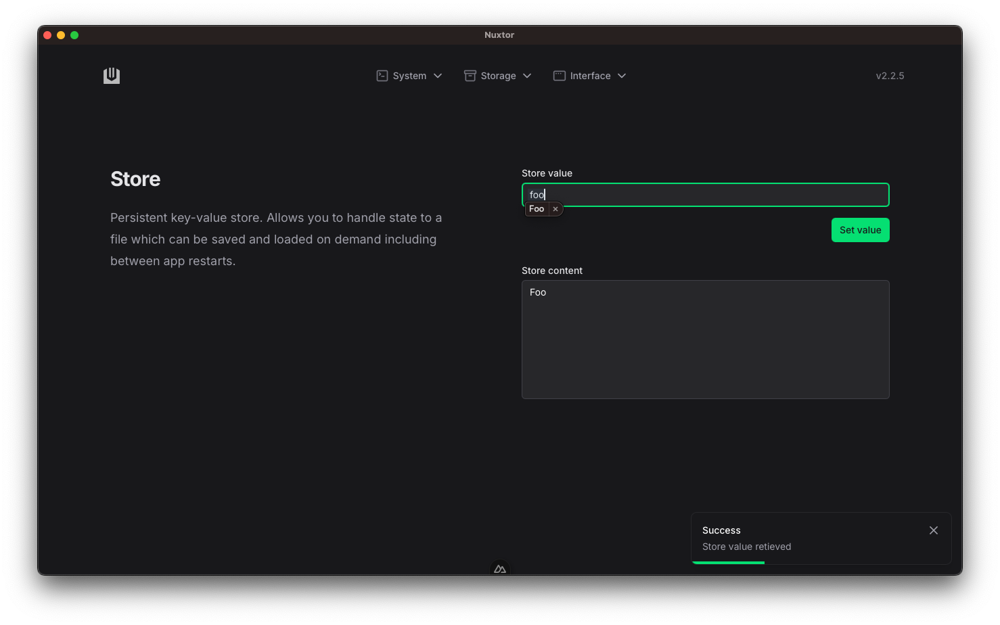
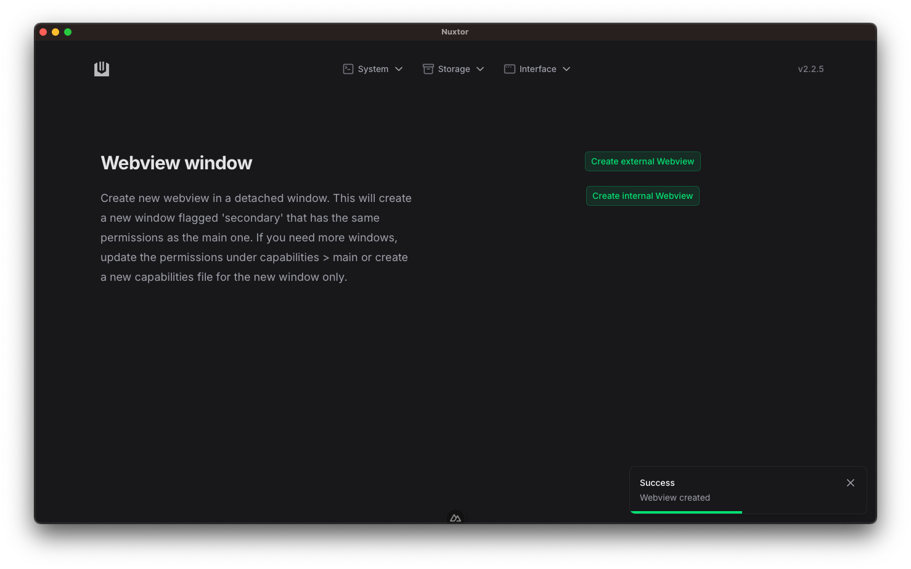

# Preview

Since Nuxtor is a compiled application, there is no way of showing the look and feel of the released project.

What follows are each page and its functionalities:

## iOS version

App preview on the simulator

---

## Android version

App preview on the simulator

---

## Commands page

Access the system shell

---

## File system page

Access the file system

---

## Notifications page

Send custom notifications at os-level

---

## OS info page

Show system informations

---

## Storage page

Read & write persistent key-value data

---

## Webview page

Create a secondary detached window

